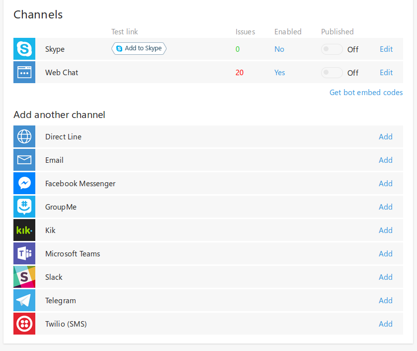
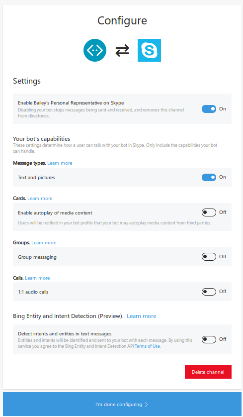

#### Intro  
Most younger people (myself included) don''t like to talk to companies on the phone and will do almost anything to avoid going somewhere in person to resolve an issue. The first place I will go to try and accomplish something would be a companies website or app (depending on the nature of what I am trying to accomplish), if I can''t accomplish it via those means, online chat is my next avenue. This is where the chatbot comes in, most conversations can be handled using an automated system, better yet the user doesn''t even need to know they are chatting with a bot. Depending on the number of users who engage you over chat and the quality of your bot, you could save a ton of time and money with a chatbot.    

The purpose of the post is to show you how to create a simple bot using a simple and scalable approach. The Microsoft Bot Framework provides us with a common programming model with which we can connect to a number of different <a target="_blank" href="https://docs.botframework.com/en-us/faq/#what-channels-does-the-bot-framework-currently-support">channels</a> as well as an easy way to integrate with LUIS, a cognitive service from Microsoft that provides language understanding capabilities.  

##### Build your bot
###### Prerequisites  
You will need to install a few things to get started:  

* <a target="_blank" href="https://nodejs.org/en/download/">Node</a> - I would use a newer version
* <a target="_blank" href="http://yeoman.io/">yeoman</a> - `npm install -g yo`  
* <a target="_blank" href="https://github.com/swellaby/generator-swell">swellaby typescript generator</a> - `npm install -g generator-swell`  
* <a target="_blank" href="https://download.botframework.com/bf-v3/tools/emulator/publish.htm">Bot Channel Emulator</a>* - Not required and only available for windows  
* You will also want a good text editor, I recommend <a target="_blank" href="https://code.visualstudio.com">VS Code</a> but you can use whatever you want. 

If you don''t have a Microsoft account you will want to create one. You will use this to create an app on <a target="_blank" href="https://luis.ai">LUIS</a> and to register your bot on the <a target="_blank" href="https://dev.botframework.com">bot registry</a>.  

###### Create and Review Project Structure  
First you will need to generate the scaffolding for your project. To do this open a command prompt and run `yo swell`, answer the the type prompt with `New Chatbot` and enter `y` when asked if you would like to install dependencies.

After this if you navigate into your newly created directory (which will have the name you gave the generator for your app), you should notice the following files/folders:  

* <a target="_blank" href="https://github.com/beverts312/sample-bot/tree/master/build">build</a> - This folder contains the gulp tasks & configuration  
* <a target="_blank" href="https://github.com/beverts312/sample-bot/blob/master/package.json">package.json</a> - App info, dependencies, script   
* <a target="_blank" href="https://github.com/beverts312/sample-bot/tree/master/src">src</a> - Holds app files  
* <a target="_blank" href="https://github.com/beverts312/sample-bot/tree/master/test">test</a> - Holds test files  
* <a target="_blank" href="https://github.com/beverts312/sample-bot/blob/master/tsconfig.json">tsconfig.json</a> - Typescript Configuration  
* <a target="_blank" href="https://github.com/beverts312/sample-bot/blob/master/tslint.json">tslint.json</a> - Typescript Lint Settings  
* You will notice a few other files as well

To make the dev loop easier we have provided the a number of npm scripts in the scaffolding. These are the important ones:  

* `npm run build` - This transpiles the typescript into javascript
* `npm run test` - This runs the unit tests and generates a coverage report
* `npm run clean` - This removes the `.js` and `.js.map` files

Lets take a dive into `src`, where our chatbot really lives:  

* <a target="_blank" href="https://github.com/beverts312/sample-bot/blob/master/src/bot.ts">bot.ts</a> - This is main class. The purpose of this class is to configure the bot. It sets defaults, registers dialogs to paths, and binds intents to paths. The class provided by the scaffolding assumes that you are planning on using LUIS for your intent engine.
* <a target="_blank" href="https://github.com/beverts312/sample-bot/blob/master/src/config.ts">config.ts</a> - This file is used for configuration of the app.  
* <a target="_blank" href="https://github.com/beverts312/sample-bot/blob/master/src/console.ts">console.ts</a> - This script starts the bot for interaction over the console. This would only happen in dev scenarios.   
* <a target="_blank" href="https://github.com/beverts312/sample-bot/blob/master/src/server.ts">server.ts</a> - This script starts the bot for interaction using a web server. The scaffolding chooses restify (which is very similar to express).  
* <a target="_blank" href="https://github.com/beverts312/sample-bot/blob/master/src/dialogs">dialogs</a> - This folder is where the dialogs will go.
* <a target="_blank" href="https://github.com/beverts312/sample-bot/blob/master/src/dialogs/dialog-base.ts">dialogs/dialog-base.ts</a> - All dialogs will inherit from this class, it provides the base property and method that we we use to bind dialogs to paths.
* <a target="_blank" href="https://github.com/beverts312/sample-bot/blob/master/src/dialogs/sample.ts">dialogs/sample.ts</a> - This is an extremely simple dialog that tells the chatter what their favorite food is.

###### Run the sample bot  
Before we modify the bot to do something new, let''s test out what is provided by the scaffolding over the console.  

1. Transpile the code - `npm run build`  
2. Start the bot on the console - `node src/console.js`
3. Using natural language tell the bot what your favorite food is (i.e. "My favorite food is ice cream" or "I love apples")  

One of Three different thing will probably happen:  

* Ideal Case - The bot (more specifically LUIS), will recognize that you were trying to tell it what your favorite food was, and what that food was and respond back to you with that (i.e "Your favorite food is ice cream")
* Another possibility is that LUIS new you were trying to tell it what your favorite food was but could not identify what it was, the bot will respond with "What is your favorite food?", looking for a direct answer to that question, and will the respond telling you what your favorite food is  
* Worst Case - LUIS doesn''t understand what you are talking about and the bot will respond to you telling you that 

While this is a pretty simple scenario , lets talk about what is happening in the first 2 cases. Your text is sent of to LUIS (a model I trained), when LUIS determines that you are talking about your favorite food this is determining **intent**.  

On line 52 of `bot.ts` you will see:  
```typescript
 this.dialog.matches(''favoriteFood'',config.dialogs.paths.sample);
``` 
This line is binding the `favoriteFood` intent (which is definied in LUIS), to a path defined in our config file.

On line 46 of `bot.ts` you will see:  
```typescript
(new SampleDialog()).register(this.bot,config.dialogs.paths.sample);
```  

Here we are binding our `SampleDialog` to that same path. This is how we get into the dialog defined in our `dialogs/sample.ts`.  

The dialog really starts on line 11 of the `SampleDialog` class. This is the method into which the program will flow when the `favoriteFood` intent is returned from LUIS. The first thing we try to do is retrieve an **entity** (in this case the favorite food) from the information returned by LUIS. Entities must be defined in LUIS, in some cases an entity will not be passed by the user and other times the entity will be passed but not detected by LUIS. We attempt this in this block of code:  
```typescript
session.userData.food = builder.EntityRecognizer.findEntity(args.entities, ''food'');
```
Later in the dialog we check to see if we actually found the entity, and if we did we  (lines 15-18) set the value appropriately and move to the next function (ideal case). If we failed to detect the entity we prompt the user for it (lines 13-15).  

Intent and Entities are important LUIS concepts, read more about them in the <a target="_blank" href="https://www.microsoft.com/cognitive-services/en-us/LUIS-api/documentation/GetStartedWithLUIS-Basics">official docs</a>.    

###### Create your own intents & dialog
The first thing we will want to do is create a new LUIS app and update our `config.ts` to reference it.  

1. Go to <a target="_blank" href="https://luis.ai">https://luis.ai</a>
2. Sign In/Up  
3. Click "Create New App" and fill out the form
4. Navigate to your app and click "App Settings" to retrieve your ID and Key
5. Replace my ID and Key on lines 36-37 of your `config.ts` with the ones you retrieved from LUIS 

You can add intents and entities to LUIS, as well as train it using the web UI. **Remember to publish your updated model after training it!** You will want to refer to the LUIS docs (linked above) for details on how to do this, however the UI is pretty straightforward.   

After we have created the intent in LUIS, we will want to create a dialog to handle that intent. For your first dialog, I would rename the file `src/dialogs/sample.ts` to something that reflects the purpose of that dialog. Modify the class name and export from `Sample` to the name of your dialog. After that you will want to write your actual dialog by replacing the setting of the dialog object (starting on line 10). There are a variety of ways to write your dialog, take a look at the documentation <a target="_blank" href="https://docs.botframework.com/en-us/node/builder/chat/dialogs/#navtitle">here</a>.

Each intent created on LUIS will need to be tied to a dialog so that we can handle the conversation in our code. To do this we will need to do the following in `bot.ts`:  
1. Import the dialog (replace line 3 for the first one)  
```
import SampleDialog = require(''./dialogs/sample'');
```  
2. Bind your dialog to a path (replace line 45 for the first one), your path should be defined in your `config.ts`  
```
(new SampleDialog()).register(this.bot, config.dialogs.paths.sample);
```  
3. Then bind your intent to the same path (replace line 49 for your first one)  
```
this.dialog.matches(''favoriteFood'', config.dialogs.paths.sample);
```

###### Additional notes about building on the scaffolding
A few general notes about building on the scaffolding.

* In the real world you will probably have some additional classes to connect to services, I would recommend creating a folder under `src` named `data-access` to hold these classes 
* Manage your listen port in `config.ts`
* I elected to put dialog strings in `config.ts`, as your bot grows you may want to move these out into a separate config file. You could also put the strings in line but the feels wrong to me. 
* This server listens on `http`, to register your bot on the framework you need an `https` endpoint **with a trusted cert**, an easy way to do this is put your bot behind a proxy using AWS API gateway

#### Chatting with your bot on popular channels  
The Microsoft Bot Framework makes it easy to engage chatters on a variety of channels using the same code base. It also provides a layer of abstraction between your chatbot application and the channels you engage your users with.    

Most of the available channels are self explanatory with the exception of two:  

* **Web Chat** - The bot framework will provide you with an url that you can put in an iframe and embed the chatbot on your website
* **Direct Line** - This provides an API with which you can engage your bot.  

To give you an idea of how difficult it is to configure a channel lets look at the skype configuration.  

First you would click edit on the Skype Channel of the Bot Management UI.  
  

Then you simply fillout this form: 


Pretty straightforward right!?!  
 
#### Conclusion  
The Microsoft Bot Framework provides a good programming model and an easy method to integrate with a number of different channels. LUIS provides an approachable interface with which people who are not necessarily "data scientists" to develop and leverage a model for processing and understanding natural language.  
 
Hopefully now you have an idea how you can build a chatbot and connect it to channels so you can start engaging users in new ways. Soon I will make a post showing how to debug the chatbot using Visual Studio Code.